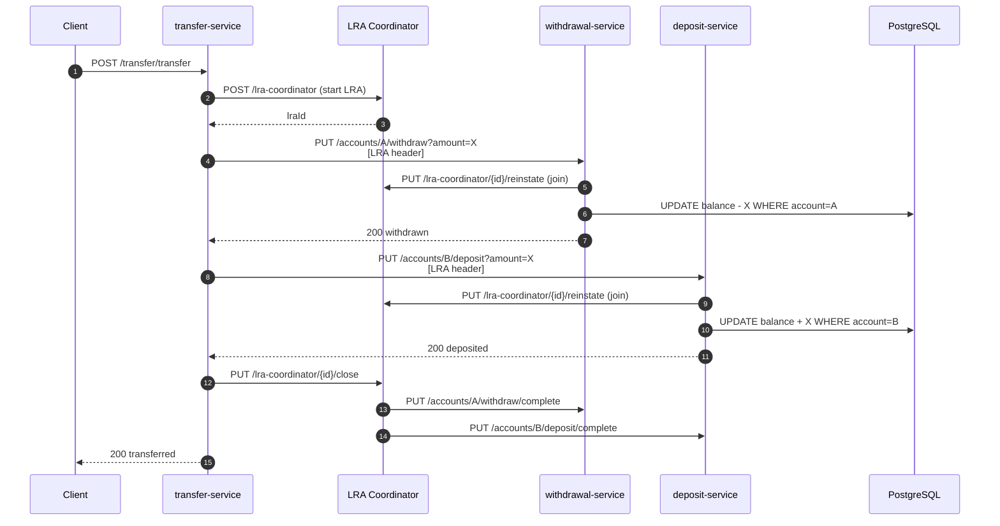
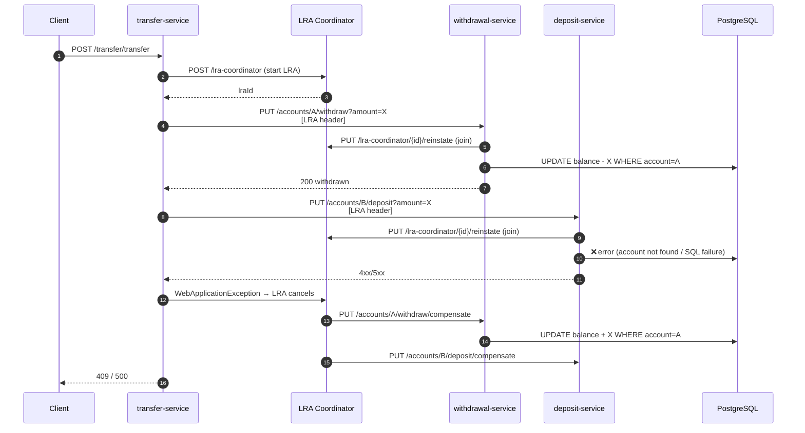

# SAGA with Liberty — MicroProfile LRA Fund Transfer

Three Open Liberty microservices that implement the **SAGA pattern** for a bank-account fund transfer, coordinated by **MicroProfile LRA 2.0** (Long Running Actions).

```
transfer-service  ──→  withdrawal-service  (debit source account)
      └──────────────→  deposit-service     (credit destination account)
```

If either downstream call fails the **LRA coordinator** automatically invokes every enrolled participant's `@Compensate` endpoint, rolling back any completed steps.

---

## Services

| Service | Port | Context root | Role |
|---------|------|--------------|------|
| `deposit-service` | 9081 | `/deposit` | LRA participant — credits an account |
| `withdrawal-service` | 9082 | `/withdrawal` | LRA participant — debits an account |
| `transfer-service` | 9083 | `/transfer` | LRA orchestrator — starts the LRA and calls both participants |
| Narayana LRA coordinator | 8070 | `/lra-coordinator` | Transaction coordinator |
| PostgreSQL 16 | 5432 | — | Shared database |

---

## Liberty User Feature — `client-lra-feature`

The `client-lra-feature/` directory contains a standalone Liberty user feature project that packages the MicroProfile LRA 2.0 client-side JAX-RS filter as an installable OSGi bundle.

### What it provides

- Installs as **`usr:clientLRA-2.0`** in any Liberty `server.xml`
- Adds a **`<lraCoordinator>`** config element for specifying the coordinator host and port directly in `server.xml`
- Exposes `com.ibm.saga.clientlra.api` as a public API package on the application class path

### Jakarta EE compatibility

The feature's OSGi bundle imports Jakarta packages with version ranges that cover **both Jakarta EE 10 and Jakarta EE 11**. Either generation can be used in the same `server.xml`.

| Liberty feature | Spec | Jakarta EE generation |
|---|---|---|
| `restfulWS-3.1` | JAX-RS 3.1 | EE 10 |
| `restfulWS-4.0` | JAX-RS 4.0 | EE 11 |
| `cdi-4.0` | CDI 4.0 | EE 10 |
| `cdi-4.1` | CDI 4.1 | EE 11 |
| `jsonb-3.0` | JSON-B 3.0 | EE 10 and EE 11 (unchanged) |
| `jsonp-2.1` | JSON-P 2.1 | EE 10 and EE 11 (unchanged) |

> **Minimum requirement:** Jakarta EE 10 (`restfulWS-3.1`, `cdi-4.0`). Jakarta EE 11 (`restfulWS-4.0`, `cdi-4.1`) is fully supported and is the default in `server-sample/server.xml`.

### Build

```bash
cd client-lra-feature
mvn clean package
```

Produces `feature/target/clientLRA-2.0-feature.zip` containing:
```
usr/extension/lib/com.ibm.saga.clientlra.jar
usr/extension/lib/features/clientLRA-2.0.mf
```

### Install

```bash
# Install into a Liberty user directory
./install-feature.sh /path/to/wlp/usr

# Or unzip manually
unzip feature/target/clientLRA-2.0-feature.zip -d /path/to/wlp/usr
```

### Configure in server.xml

**Jakarta EE 11 (recommended):**
```xml
<featureManager>
    <feature>restfulWS-4.0</feature>
    <feature>cdi-4.1</feature>
    <feature>jsonb-3.0</feature>
    <feature>jsonp-2.1</feature>
    <feature>mpConfig-3.1</feature>
    <feature>usr:clientLRA-2.0</feature>
</featureManager>

<!-- Required: coordinator host and port -->
<lraCoordinator host="lra-coordinator" port="8070"/>
```

**Jakarta EE 10:**
```xml
<featureManager>
    <feature>restfulWS-3.1</feature>
    <feature>cdi-4.0</feature>
    <feature>jsonb-3.0</feature>
    <feature>jsonp-2.1</feature>
    <feature>mpConfig-3.1</feature>
    <feature>usr:clientLRA-2.0</feature>
</featureManager>

<!-- Required: coordinator host and port -->
<lraCoordinator host="lra-coordinator" port="8070"/>
```

The `path` attribute of `<lraCoordinator>` is optional and defaults to `/lra-coordinator`.

---

## Quick Start — `start-local.sh`

The easiest way to run everything locally. The script auto-detects `docker` or `podman` for PostgreSQL, runs the LRA coordinator as a local JVM process (no container required), builds all three services, and runs a smoke test.

### Prerequisites

- Java 17+, Maven 3.9+, `curl`
- Docker **or** Podman (for PostgreSQL only)

### Run

```bash
chmod +x start-local.sh
./start-local.sh
```

The script will:

1. Start **PostgreSQL** in a container
2. Download and start the **Narayana LRA coordinator** as a JVM process on port 8070 (JAR cached in `.lra/` after first run)
3. Download the **PostgreSQL JDBC driver** into each Liberty server's shared resources directory
4. Build all three services with `mvn package -DskipTests`
5. Start `deposit-service`, `withdrawal-service`, and `transfer-service` via `mvn liberty:run`
6. Run a smoke-test transfer and print a summary

Press **Ctrl+C** to stop all services cleanly.

### Flags

| Flag | Effect |
|------|--------|
| `--skip-build` | Skip `mvn package`; use existing `target/` WARs |
| `--use-container` | Run the LRA coordinator in a container instead of a JVM process |

```bash
./start-local.sh --skip-build
./start-local.sh --use-container
./start-local.sh --skip-build --use-container
```

### Logs

All service logs are written to `.logs/`:

```
.logs/
  postgres.log
  lra-coordinator.log     ← coordinator runs in DEBUG mode
  deposit-service.log
  withdrawal-service.log
  transfer-service.log
```

---

## Quick Start — Docker Compose

Builds and runs everything inside containers (including the Liberty services).

```bash
docker-compose up --build
```

---

## Testing

### Successful transfer

```bash
curl -s -X POST http://localhost:9083/transfer/transfer \
  -H "Content-Type: application/json" \
  -d '{"fromAccount":"ACC-001","toAccount":"ACC-002","amount":100.00}' | jq .
```

Expected response:
```json
{"status":"transferred","from":"ACC-001","to":"ACC-002","amount":100.00}
```

### Compensating rollback (insufficient funds)

```bash
curl -s -X POST http://localhost:9083/transfer/transfer \
  -H "Content-Type: application/json" \
  -d '{"fromAccount":"ACC-002","toAccount":"ACC-001","amount":99999.00}' | jq .
```

The withdrawal fails, the LRA cancels immediately, and no deposit is made.

### Verify the coordinator is being called

The coordinator log is in DEBUG mode. The key lines to watch:

```bash
# Every inbound HTTP call to the coordinator
grep "PathInfo" .logs/lra-coordinator.log

# LRA lifecycle events (start, join, close, cancel)
grep "io.nar.lra" .logs/lra-coordinator.log

# Compensation calls
grep -i "cancel\|compensat" .logs/lra-coordinator.log

# Errors or warnings only
grep "ERROR\|WARN" .logs/lra-coordinator.log
```

A complete happy-path transfer produces **5 coordinator calls** in quick succession:

| # | Call | Initiator |
|---|------|-----------|
| 1 | `POST /lra-coordinator` | transfer-service starts the LRA |
| 2 | `PUT /lra-coordinator/{id}/reinstate` | withdrawal-service joins |
| 3 | `PUT /lra-coordinator/{id}/reinstate` | deposit-service joins |
| 4 | `PUT /lra-coordinator/{id}/close` | transfer-service closes the LRA |
| 5 | `@Complete` callbacks | coordinator → both participants |

---

## Architecture — LRA Flow

### Happy path



### Compensation path (failure)



---

## API Reference

### transfer-service

| Method | Path | Body | Description |
|--------|------|------|-------------|
| POST | `/transfer/transfer` | `TransferRequest` JSON | Execute a SAGA transfer |

`TransferRequest`:
```json
{
  "fromAccount": "ACC-001",
  "toAccount":   "ACC-002",
  "amount":      150.00
}
```

### deposit-service

| Method | Path | Query | Description |
|--------|------|-------|-------------|
| PUT | `/deposit/accounts/{acct}/deposit` | `amount` | Deposit (LRA participant) |
| PUT | `/deposit/accounts/{acct}/deposit/compensate` | `amount` | Compensate (reverse deposit) |
| PUT | `/deposit/accounts/{acct}/deposit/complete` | — | Complete callback |

### withdrawal-service

| Method | Path | Query | Description |
|--------|------|-------|-------------|
| PUT | `/withdrawal/accounts/{acct}/withdraw` | `amount` | Withdraw (LRA participant) |
| PUT | `/withdrawal/accounts/{acct}/withdraw/compensate` | `amount` | Compensate (reverse withdrawal) |
| PUT | `/withdrawal/accounts/{acct}/withdraw/complete` | — | Complete callback |

---

## Configuration

### deposit-service / withdrawal-service / transfer-service

All three services read from `META-INF/microprofile-config.properties`. Any value can be overridden with the corresponding environment variable (uppercase, dots replaced with underscores).

| Property | Default | Service |
|----------|---------|---------|
| `lra.coordinator.url` | `http://localhost:8070/lra-coordinator` | all |
| `withdrawal.service.url` | `http://localhost:9082/withdrawal` | transfer-service |
| `deposit.service.url` | `http://localhost:9081/deposit` | transfer-service |
| `db.host` | `localhost` | deposit, withdrawal |
| `db.port` | `5432` | deposit, withdrawal |
| `db.name` | `sagadb` | deposit, withdrawal |
| `db.user` | `saga` | deposit, withdrawal |
| `db.password` | `saga` | deposit, withdrawal |

### client-lra-feature

The coordinator is configured exclusively via `server.xml` using the `<lraCoordinator>` element provided by the feature. There is no MicroProfile Config or environment-variable fallback.

| Attribute | Default | Description |
|-----------|---------|-------------|
| `host` | `localhost` | Hostname or IP of the LRA coordinator |
| `port` | `8070` | HTTP port of the LRA coordinator |
| `path` | `/lra-coordinator` | Context path of the coordinator REST API |

---

## Logging

All three services use `java.util.logging.Logger` (JUL), which integrates natively with Open Liberty's logging pipeline.

| Level | What is logged |
|-------|----------------|
| `INFO` | Request entry, success, LRA `@Complete` callbacks |
| `FINE` | Intermediate step confirmations within a transfer |
| `WARNING` | Business failures (invalid input, insufficient funds, downstream errors), LRA `@Compensate` callbacks |
| `SEVERE` | SQL / infrastructure errors |

The LRA coordinator itself runs at `DEBUG` level; its output goes to `.logs/lra-coordinator.log`.
